# Self-Hypnosis App - Improved Mobile Architecture

```mermaid
classDiagram
  %% =================================
  %% PRESENTATION LAYER (UI Only)
  %% =================================
  class LoginScreen {
    +render() JSX.Element
    +onEmailChange(email) void
    +onPasswordChange(password) void
    +onSubmit() void
  }
  
  class VerifyEmailScreen {
    +render() JSX.Element
    +onResendPress() void
    +onChangeEmailPress() void
  }
  
  class HomeScreen {
    +render() JSX.Element
    +onSessionSelect(sessionId) void
    +onGeneratePress() void
    +onRefresh() void
  }
  
  class GenerateScreen {
    +render() JSX.Element
    +onQuickModePress() void
    +onAdvancedModePress() void
    +onReviewPress() void
  }
  
  class ReviewScreen {
    +render() JSX.Element
    +onGeneratePress() void
    +onEditPress() void
  }
  
  class PlaybackScreen {
    +render() JSX.Element
    +onPlayPress() void
    +onPausePress() void
    +onSeek(position) void
    +onDownloadPress() void
  }

  %% =================================
  %% STATE MANAGEMENT LAYER
  %% =================================
  class GlobalState {
    +user: UserState
    +auth: AuthState
    +sessions: SessionState
    +playback: PlaybackState
    +app: AppState
    +dispatch(action) void
    +subscribe(listener) void
  }
  
  class UserState {
    +current: User | null
    +profile: UserProfile
    +preferences: UserPreferences
    +isLoading: boolean
    +error: string | null
  }
  
  class AuthState {
    +isAuthenticated: boolean
    +token: string | null
    +isLoading: boolean
    +verificationStatus: VerificationStatus
  }
  
  class SessionState {
    +current: Session | null
    +recent: Session[]
    +suggested: Session[]
    +generationStatus: GenerationStatus
    +quota: QuotaInfo
  }
  
  class PlaybackState {
    +currentSession: Session | null
    +audioFile: AudioFile | null
    +isPlaying: boolean
    +progress: number
    +isBuffering: boolean
  }

  %% =================================
  %% VIEW MODEL LAYER (Screen Logic)
  %% =================================
  class AuthViewModel {
    +login(email, password) Promise~void~
    +registerOrLogin(email, password) Promise~void~
    +sendVerificationEmail(email) Promise~void~
    +resendVerification() Promise~void~
    +initializeVerification() Promise~void~
    +verifyEmail(token) Promise~void~
    +logout() Promise~void~
    +saveSelectedGoals(goals) Promise~void~
    +saveProfile(profile) Promise~void~
    +previewVoice(voiceId) Promise~void~
    -authService: AuthService
    -userService: UserService
    -state: GlobalState
  }
  
  class HomeViewModel {
    +initializeHome() Promise~void~
    +loadDashboard() Promise~void~
    +refreshContent() Promise~void~
    +selectSession(sessionId) void
    +getSessionDetails(sessionId) Promise~void~
    +initiateDownload(sessionId) Promise~void~
    -sessionService: SessionService
    -userService: UserService
    -audioService: AudioService
    -permissionService: PermissionService
    -state: GlobalState
  }
  
  class SessionCreationViewModel {
    +createQuickSession(params) Promise~void~
    +createAdvancedSession(params) Promise~void~
    +saveAsDraft() Promise~void~
    +validateQuota() Promise~boolean~
    -sessionService: SessionService
    -quotaService: QuotaService
    -audioGenerationViewModel: AudioGenerationViewModel
    -state: GlobalState
  }
  
  class AudioGenerationViewModel {
    +generateAudio(sessionId) Promise~void~
    +initializeReview(sessionId) Promise~void~
    +estimateGenerationTime(session) number
    +cancelGeneration() void
    +trackProgress() void
    +evaluateOfflineCapabilities(sessionId) boolean
    -audioService: AudioService
    -sessionService: SessionService
    -networkService: NetworkService
    -state: GlobalState
  }
  
  class PlaybackViewModel {
    +loadSession(sessionId) Promise~void~
    +play() void
    +pause() void
    +seek(position) void
    +downloadForOffline() Promise~void~
    -audioService: AudioService
    -state: GlobalState
  }

  %% =================================
  %% SERVICE LAYER (Business Logic)
  %% =================================
  class NavigationService {
    +navigate(screen, params) void
    +goBack() void
    +reset(routeName) void
    +getCurrentRoute() string
  }
  
  class ErrorService {
    +handleError(error, context) void
    +reportError(error) void
    +showUserFriendlyError(error) void
    +logError(error, metadata) void
  }
  
  class AuthService {
    +signIn(email, password) Promise~AuthResult~
    +signUp(email, password) Promise~User~
    +register(email, password, profile) Promise~User~
    +sendVerification(email) Promise~void~
    +resendVerificationLink() Promise~void~
    +verificationConfirmed() Promise~void~
    +signOut() Promise~void~
    +refreshToken() Promise~string~
    -apiClient: ApiClient
    -cacheService: CacheService
  }
  
  class UserService {
    +getProfile(userId) Promise~User~
    +loadUserProfile() Promise~User~
    +updateProfile(updates) Promise~void~
    +saveProfile(profile) Promise~void~
    +updatePreferences(prefs) Promise~void~
    +saveGoals(goals) Promise~void~
    +getVoicePreview(voiceId) Promise~AudioFile~
    +getQuotaInfo(userId) Promise~QuotaInfo~
    -apiClient: ApiClient
    -cacheService: CacheService
  }
  
  class QuotaService {
    +checkRemaining(userId) Promise~QuotaInfo~
    +consumeOne(userId) Promise~void~
    +updateQuota(userId, remaining) Promise~void~
    +isExhausted(userId) boolean
    -quotaRepository: QuotaRepository
    -globalState: GlobalState
  }
  
  class SessionService {
    +create(params) Promise~Session~
    +getSession(sessionId) Promise~Session~
    +createSessionDraft(params) Promise~Session~
    +completeSession(sessionId, audioFile) Promise~void~
    +getRecent(limit) Promise~Session[]~
    +getSuggested() Promise~Session[]~
    +delete(sessionId) Promise~void~
    +updateStatus(sessionId, status) Promise~void~
    -apiClient: ApiClient
    -cacheService: CacheService
    -syncService: SyncService
  }
  
  class AudioService {
    %% Script Generation
    +generateScript(session) Promise~string~
    +validateScript(script) boolean
    +estimateLength(session) number
    
    %% Audio Synthesis
    +synthesizeAudio(script, voice) Promise~AudioFile~
    +getVoices() Promise~Voice[]~
    +previewVoice(voiceId, text) Promise~AudioFile~
    
    %% Audio Management
    +saveAudio(audioFile) Promise~void~
    +getAudio(sessionId) Promise~AudioFile~
    +downloadAudio(url) Promise~AudioFile~
    +downloadForOffline(sessionId, audioFile) Promise~void~
    +checkOfflineAvailability(sessionId) Promise~OfflineStatus~
    +deleteAudio(fileId) Promise~void~
    +getLocalPath(fileId) string
    +isOfflineAvailable(sessionId) boolean
    
    %% Playback Control
    +loadAudio(sessionId) Promise~AudioFile~
    +play() void
    +pause() void
    +seekTo(position) void
    +getCurrentTime() number
    +getDuration() number
    
    %% Dependencies
    -llmClient: LLMClient
    -templateEngine: TemplateEngine
    -ttsClient: TTSClient
    -audioProcessor: AudioProcessor
    -audioPlayer: AudioPlayer
    -storageService: StorageService
    -permissionService: PermissionService
  }
  
  class CacheService {
    +get(key) Promise~any~
    +set(key, value, ttl) Promise~void~
    +delete(key) Promise~void~
    +clear() Promise~void~
    +isExpired(key) Promise~boolean~
  }
  
  class SyncService {
    +sync() Promise~void~
    +queueOperation(operation) void
    +processQueue() Promise~void~
    +getOfflineChanges() SyncOperation[]
    +markAsSynced(operationId) void
    -networkService: NetworkService
  }
  
  class NetworkService {
    +isOnline() boolean
    +onNetworkChange(callback) void
    +getConnectionType() ConnectionType
  }
  
  class PermissionService {
    +checkStoragePermission() Promise~PermissionStatus~
    +requestStoragePermission() Promise~boolean~
    +updatePermissionStatus(status) void
    +hasStoragePermission() boolean
    -storageService: StorageService
  }

  %% =================================
  %% DATA LAYER (Infrastructure)
  %% =================================
  class ApiClient {
    +get(url, params) Promise~Response~
    +post(url, data) Promise~Response~
    +put(url, data) Promise~Response~
    +delete(url) Promise~Response~
    +upload(url, file) Promise~Response~
    -httpClient: HttpClient
    -authInterceptor: AuthInterceptor
  }
  
  class StorageService {
    +getString(key) Promise~string~
    +setString(key, value) Promise~void~
    +getObject(key) Promise~object~
    +setObject(key, value) Promise~void~
    +remove(key) Promise~void~
    +clear() Promise~void~
  }
  


  %% =================================
  %% DOMAIN MODELS (Improved)
  %% =================================
  class User {
    +id: string
    +email: string
    +profile: UserProfile
    +preferences: UserPreferences
    +quotaInfo: QuotaInfo
    +createdAt: Date
    +lastActiveAt: Date
  }
  
  class UserProfile {
    +name: string
    +isVerified: boolean
    +selectedGoals: Goal[]
    +voicePreference: VoicePreference
  }
  
  class Session {
    +id: string
    +userId: string
    +title: string
    +config: SessionConfig
    +status: SessionStatus
    +audioFile: AudioFile | null
    +createdAt: Date
    +updatedAt: Date
  }
  
  class SessionConfig {
    +duration: number
    +goals: Goal[]
    +voice: VoicePreference
    +background: BackgroundConfig
    +advanced: AdvancedConfig | null
  }
  
  class SessionStatus {
    <<enumeration>>
    DRAFT
    GENERATING_SCRIPT
    GENERATING_AUDIO
    READY
    FAILED
    ARCHIVED
  }
  
  class AudioFile {
    +id: string
    +sessionId: string
    +url: string
    +localPath: string | null
    +metadata: AudioMetadata
    +isDownloaded: boolean
    +downloadedAt: Date | null
  }
  
  class Goal {
    +id: string
    +name: string
    +category: string
    +description: string
    +isDefault: boolean
    +icon: string
  }
  
  class QuotaInfo {
    +remaining: number
    +total: number
    +resetDate: Date
    +isBeta: boolean
    +isExhausted: boolean
  }

  %% =================================
  %% ERROR HANDLING
  %% =================================
  class AppErrorBoundary {
    +componentDidCatch(error, info) void
    +render() JSX.Element
  }
  
  class ErrorHandler {
    +handle(error, context) void
    +shouldReport(error) boolean
    +getUserMessage(error) string
  }

  %% =================================
  %% DEPENDENCIES
  %% =================================
  
  %% Screens use ViewModels and State
  LoginScreen --> AuthViewModel
  LoginScreen --> GlobalState
  VerifyEmailScreen --> AuthViewModel
  HomeScreen --> HomeViewModel
  HomeScreen --> GlobalState
  GenerateScreen --> SessionCreationViewModel
  ReviewScreen --> AudioGenerationViewModel
  PlaybackScreen --> PlaybackViewModel

  %% ViewModels use Services and State
  AuthViewModel --> AuthService
  AuthViewModel --> GlobalState
  HomeViewModel --> SessionService
  HomeViewModel --> UserService
  SessionCreationViewModel --> SessionService
  AudioGenerationViewModel --> AudioService
  PlaybackViewModel --> AudioService

  %% Services use Infrastructure
  AuthService --> ApiClient
  AuthService --> CacheService
  UserService --> ApiClient
  SessionService --> ApiClient
  SessionService --> SyncService
  AudioService --> StorageService
  SyncService --> NetworkService

  %% Infrastructure
  ApiClient --> StorageService
  CacheService --> StorageService

  %% Global State contains domain state
  GlobalState --> UserState
  GlobalState --> AuthState
  GlobalState --> SessionState
  GlobalState --> PlaybackState

  %% Domain relationships
  UserState --> User
  SessionState --> Session
  PlaybackState --> AudioFile
  Session --> SessionConfig
  Session --> SessionStatus
  User --> UserProfile
  User --> QuotaInfo
```

## Improved Mobile Architecture Notes

**Clean Architecture Implementation:**
- **Presentation Layer**: Lightweight React Native screens (UI only)
- **State Management**: Centralized global state with Redux/Zustand pattern
- **ViewModel Layer**: Screen-specific business logic and coordination
- **Service Layer**: Domain business logic and external integrations
- **Infrastructure Layer**: Data access, APIs, storage, and device services

**Key Architectural Improvements:**

### 🎯 **MVVM Compliance**
- **Screens**: Pure UI components with event handlers only
- **ViewModels**: Coordinate between UI and services, manage screen state
- **Services**: Encapsulate business logic and external dependencies
- **State**: Centralized, predictable state management

### 🏗️ **Mobile-First Design Patterns**

1. **Global State Management**
   - Centralized app state with Redux/Zustand pattern
   - Separate state slices: Auth, User, Sessions, Playback
   - Predictable state updates with actions/reducers

2. **Error Handling Architecture**
   - `AppErrorBoundary` for React error catching
   - `ErrorService` for centralized error processing
   - User-friendly error messages and reporting

3. **Offline & Caching Strategy**
   - `CacheService` for API response caching
   - `SyncService` for offline operation queuing
   - `NetworkService` for connectivity monitoring
   - Offline-first data persistence

4. **Audio Management**
   - Consolidated `AudioService` handling all audio operations:
     - Script generation (LLM integration)
     - Audio synthesis (TTS integration)
     - File management and offline availability
     - Playback control

5. **Navigation Architecture**
   - `NavigationService` for centralized routing
   - Removed navigation logic from screens
   - Type-safe navigation with proper params

### 🔧 **Session Management Improvements**

1. **Proper State Machine**
   - `SessionStatus` enum: DRAFT → GENERATING_SCRIPT → GENERATING_AUDIO → READY
   - Clear status transitions for UI feedback

2. **Separated Concerns**
   - `SessionCreationViewModel`: Session creation and validation
   - `AudioGenerationViewModel`: Audio generation workflow
   - `PlaybackViewModel`: Audio playback and controls

3. **Configuration Management**
   - `SessionConfig`: Flexible session parameters
   - Eliminated complex `AdvancedOptions` in favor of structured config

### 📱 **Mobile-Specific Services**

- **CacheService**: TTL-based caching for API responses
- **SyncService**: Offline operation queuing and synchronization
- **NetworkService**: Connection monitoring and type detection
- **StorageService**: Abstracted local storage (AsyncStorage/MMKV)
- **AudioService**: Comprehensive audio management (script generation, synthesis, playback, offline)

### 🎨 **Domain Model Improvements**

1. **Structured User Model**
   - Separated `UserProfile` and `UserPreferences`
   - Integrated `QuotaInfo` within user context

2. **Flexible Session Model**
   - `SessionConfig` for all session parameters
   - Status-driven workflow with proper state machine
   - Cleaner audio file relationship

3. **Enhanced Audio Model**
   - `AudioMetadata` for technical details
   - Offline availability tracking
   - Download timestamp management

**Technology Recommendations:**
- **State Management**: Zustand or Redux Toolkit
- **Navigation**: React Navigation v6
- **Storage**: MMKV for performance
- **Networking**: React Query for server state
- **Audio**: react-native-track-player
- **Error Reporting**: Flipper/Sentry integration
