# Self-Hypnosis App - Component Architecture Diagram

```mermaid
graph TB
    %% =================================
    %% REACT NATIVE COMPONENTS (UI LAYER)
    %% =================================
    subgraph "React Native Components"
        subgraph "Onboarding Flow"
            WelcomeScreen[WelcomeScreen]
            GoalsScreen[GoalsScreen]
            PermissionInfoScreen[PermissionInfoScreen]
            ProfileBasicsScreen[ProfileBasicsScreen]
            VerifyEmailScreen[VerifyEmailScreen]
        end
        
        subgraph "Main App Screens"
            HomeScreen[HomeScreen]
            GenerateScreen[GenerateScreen]
            ReviewScreen[ReviewScreen]
            PlaybackScreen[PlaybackScreen]
            SuccessScreen[SuccessScreen]
            ErrorScreen[ErrorScreen]
        end
        
        subgraph "Shared Components"
            Header[Header]
            Navigation[BottomNavigation]
            LoadingSpinner[LoadingSpinner]
            ErrorBoundary[ErrorBoundary]
            OfflineBadge[OfflineBadge]
            QuotaBadge[QuotaBadge]
        end
    end

    %% =================================
    %% VIEW MODELS (BUSINESS LOGIC LAYER)
    %% =================================
    subgraph "ViewModels (MVVM)"
        AuthViewModel[AuthViewModel]
        HomeViewModel[HomeViewModel]
        SessionCreationViewModel[SessionCreationViewModel]
        AudioGenerationViewModel[AudioGenerationViewModel]
        PlaybackViewModel[PlaybackViewModel]
    end

    %% =================================
    %% SERVICES (BUSINESS LOGIC LAYER)
    %% =================================
    subgraph "Core Services"
        SessionService[SessionService]
        AudioService[AudioService]
        UserService[UserService]
        QuotaService[QuotaService]
        AuthService[AuthService]
        NavigationService[NavigationService]
        ErrorService[ErrorService]
    end

    %% =================================
    %% REPOSITORIES (DATA ACCESS LAYER)
    %% =================================
    subgraph "Repositories"
        SessionRepository[SessionRepository]
        AudioRepository[AudioRepository]
        UserRepository[UserRepository]
        QuotaRepository[QuotaRepository]
        CacheRepository[CacheRepository]
    end

    %% =================================
    %% INFRASTRUCTURE SERVICES
    %% =================================
    subgraph "Infrastructure"
        StorageService[StorageService]
        NetworkService[NetworkService]
        SyncService[SyncService]
        PermissionService[PermissionService]
        AudioPlayer[AudioPlayer]
    end

    %% =================================
    %% EXTERNAL SYSTEMS
    %% =================================
    subgraph "External Systems"
        AuthProvider[Auth Provider<br/>Firebase/Auth0]
        LLMService[LLM Service<br/>OpenAI/Claude]
        TTSService[TTS Service<br/>ElevenLabs/AWS Polly]
        CloudStorage[Cloud Storage<br/>AWS S3/Firebase]
        Analytics[Analytics<br/>Mixpanel/Amplitude]
    end

    %% =================================
    %% STATE MANAGEMENT
    %% =================================
    subgraph "State Management"
        GlobalState[GlobalState<br/>Zustand/Redux]
        UserState[UserState]
        AuthState[AuthState]
        SessionState[SessionState]
        PlaybackState[PlaybackState]
    end

    %% =================================
    %% COMPONENT RELATIONSHIPS
    %% =================================
    
    %% Screens use ViewModels (MVVM Pattern)
    WelcomeScreen --> AuthViewModel
    GoalsScreen --> AuthViewModel
    ProfileBasicsScreen --> AuthViewModel
    VerifyEmailScreen --> AuthViewModel
    HomeScreen --> HomeViewModel
    GenerateScreen --> SessionCreationViewModel
    ReviewScreen --> AudioGenerationViewModel
    PlaybackScreen --> PlaybackViewModel
    SuccessScreen --> PlaybackViewModel
    
    %% Screens use NavigationService
    WelcomeScreen --> NavigationService
    GoalsScreen --> NavigationService
    PermissionInfoScreen --> NavigationService
    ProfileBasicsScreen --> NavigationService
    VerifyEmailScreen --> NavigationService
    GenerateScreen --> NavigationService
    ReviewScreen --> NavigationService
    ErrorScreen --> NavigationService

    %% ViewModels use Services
    AuthViewModel --> AuthService
    AuthViewModel --> UserService
    HomeViewModel --> SessionService
    HomeViewModel --> UserService
    HomeViewModel --> AudioService
    SessionCreationViewModel --> SessionService
    SessionCreationViewModel --> QuotaService
    SessionCreationViewModel --> AudioGenerationViewModel
    AudioGenerationViewModel --> AudioService
    AudioGenerationViewModel --> SessionService
    PlaybackViewModel --> AudioService
    
    %% ViewModels use Infrastructure Services
    HomeViewModel --> PermissionService
    AudioGenerationViewModel --> NetworkService

    %% Services use Repositories
    SessionService --> SessionRepository
    AudioService --> AudioRepository
    UserService --> UserRepository
    QuotaService --> QuotaRepository
    AuthService --> UserRepository
    AuthService --> CacheRepository
    
    %% Additional Service Dependencies
    QuotaService --> GlobalState
    AudioService --> PermissionService

    %% Services use Infrastructure
    AudioService --> StorageService
    AudioService --> AudioPlayer
    SessionService --> NetworkService
    SyncService --> NetworkService
    PermissionService --> StorageService

    %% Repositories use External Systems
    SessionRepository --> CloudStorage
    AudioRepository --> CloudStorage
    UserRepository --> AuthProvider
    CacheRepository --> StorageService

    %% Services use External Systems
    AudioService --> LLMService
    AudioService --> TTSService
    AuthService --> AuthProvider
    Analytics --> Analytics

    %% State Management
    GlobalState --> UserState
    GlobalState --> AuthState
    GlobalState --> SessionState
    GlobalState --> PlaybackState

    %% ViewModels use State
    AuthViewModel --> GlobalState
    HomeViewModel --> GlobalState
    SessionCreationViewModel --> GlobalState
    AudioGenerationViewModel --> GlobalState
    PlaybackViewModel --> GlobalState

    %% Shared Components
    Header --> NavigationService
    Navigation --> NavigationService
    OfflineBadge --> NetworkService
    QuotaBadge --> QuotaService

    %% Error Handling
    ErrorBoundary --> ErrorService
    ErrorScreen --> ErrorService

    %% =================================
    %% STYLING AND THEMES
    %% =================================
    subgraph "Styling & Themes"
        ThemeProvider[ThemeProvider]
        ColorScheme[ColorScheme]
        Typography[Typography]
        Spacing[Spacing]
    end

    %% Theme connections
    WelcomeScreen --> ThemeProvider
    HomeScreen --> ThemeProvider
    GenerateScreen --> ThemeProvider
    ReviewScreen --> ThemeProvider
    PlaybackScreen --> ThemeProvider

    %% =================================
    %% STYLING
    %% =================================
    classDef screenClass fill:#e1f5fe,stroke:#01579b,stroke-width:2px
    classDef viewModelClass fill:#f3e5f5,stroke:#4a148c,stroke-width:2px
    classDef serviceClass fill:#e8f5e8,stroke:#1b5e20,stroke-width:2px
    classDef repositoryClass fill:#fff3e0,stroke:#e65100,stroke-width:2px
    classDef infrastructureClass fill:#fce4ec,stroke:#880e4f,stroke-width:2px
    classDef externalClass fill:#f1f8e9,stroke:#33691e,stroke-width:2px
    classDef stateClass fill:#fafafa,stroke:#424242,stroke-width:2px
    classDef componentClass fill:#e0f2f1,stroke:#004d40,stroke-width:2px

    %% Apply styling
    class WelcomeScreen,GoalsScreen,PermissionInfoScreen,ProfileBasicsScreen,VerifyEmailScreen,HomeScreen,GenerateScreen,ReviewScreen,PlaybackScreen,SuccessScreen,ErrorScreen screenClass
    class AuthViewModel,HomeViewModel,SessionCreationViewModel,AudioGenerationViewModel,PlaybackViewModel viewModelClass
    class SessionService,AudioService,UserService,QuotaService,AuthService,NavigationService,ErrorService serviceClass
    class SessionRepository,AudioRepository,UserRepository,QuotaRepository,CacheRepository repositoryClass
    class StorageService,NetworkService,SyncService,PermissionService,AudioPlayer infrastructureClass
    class AuthProvider,LLMService,TTSService,CloudStorage,Analytics externalClass
    class GlobalState,UserState,AuthState,SessionState,PlaybackState stateClass
    class Header,Navigation,LoadingSpinner,ErrorBoundary,OfflineBadge,QuotaBadge,ThemeProvider,ColorScheme,Typography,Spacing componentClass
```

## Component Architecture Notes

### 🏗️ **Architecture Layers**

#### **1. React Native Components (UI Layer)**
- **Onboarding Flow**: Welcome → Goals → Permissions → Profile → Verification
- **Main App Screens**: Home, Generate, Review, Playback, Success, Error
- **Shared Components**: Header, Navigation, Loading, Error handling, Badges
- **Styling System**: Theme provider, color schemes, typography, spacing

#### **2. ViewModels (MVVM Business Logic)**
- **AuthViewModel**: Handles authentication flow and user management
- **HomeViewModel**: Manages dashboard and session overview
- **SessionCreationViewModel**: Orchestrates session generation workflow
- **AudioGenerationViewModel**: Manages audio creation and processing
- **PlaybackViewModel**: Handles audio playback and controls

#### **3. Core Services (Business Logic)**
- **SessionService**: Session creation, management, and lifecycle
- **AudioService**: Script generation, TTS synthesis, audio processing
- **UserService**: User profile, preferences, and account management
- **QuotaService**: Usage tracking, limits, and quota management
- **AuthService**: Authentication, authorization, and session management
- **NavigationService**: App navigation and routing
- **ErrorService**: Centralized error handling and reporting

#### **4. Repositories (Data Access)**
- **SessionRepository**: Session data persistence and retrieval
- **AudioRepository**: Audio file management and offline storage
- **UserRepository**: User data and profile management
- **QuotaRepository**: Quota tracking and usage data
- **CacheRepository**: Local caching and performance optimization

#### **5. Infrastructure Services**
- **StorageService**: Local storage abstraction (AsyncStorage/MMKV)
- **NetworkService**: Connectivity monitoring and network state
- **SyncService**: Offline/online data synchronization
- **PermissionService**: Device permission management
- **AudioPlayer**: Native audio playback control

### 🔗 **External System Integrations**

#### **Authentication & User Management**
- **Auth Provider**: Firebase Auth, Auth0, or custom solution
- **User Data**: Secure user profile and preference storage

#### **AI & Audio Services**
- **LLM Service**: OpenAI GPT, Claude, or other AI providers
- **TTS Service**: ElevenLabs, AWS Polly, or Google TTS
- **Script Generation**: AI-powered hypnosis script creation

#### **Data & Analytics**
- **Cloud Storage**: AWS S3, Firebase Storage for audio files
- **Analytics**: Mixpanel, Amplitude for user behavior tracking
- **Performance Monitoring**: Crash reporting and app metrics

### 📱 **React Native Specific Features**

#### **Component Architecture**
- **Functional Components**: Modern React hooks and functional patterns
- **TypeScript**: Type-safe component props and state
- **Performance**: React.memo, useMemo, useCallback optimizations
- **Accessibility**: Screen reader support and accessibility features

#### **Navigation & Routing**
- **React Navigation**: Stack and tab navigation
- **Deep Linking**: URL-based navigation and sharing
- **Screen Transitions**: Smooth animations and transitions

#### **State Management**
- **Zustand/Redux**: Centralized state management
- **Async State**: Loading, error, and success states
- **Persistence**: Offline state and data synchronization

### 🔧 **Technical Implementation**

#### **Dependency Management**
- **Package Manager**: npm/yarn with lock files
- **Native Dependencies**: React Native modules for device features
- **Version Control**: Semantic versioning and dependency updates

#### **Build & Deployment**
- **Metro Bundler**: React Native bundling and optimization
- **Code Splitting**: Lazy loading for performance
- **Environment Configs**: Development, staging, production builds

#### **Testing & Quality**
- **Unit Testing**: Jest for component and service testing
- **Integration Testing**: Component integration and user flows
- **E2E Testing**: Detox for end-to-end testing
- **Code Quality**: ESLint, Prettier, and TypeScript strict mode

### 🎨 **UI/UX Components**

#### **Design System**
- **Theme Provider**: Consistent styling across the app
- **Color Schemes**: Light/dark mode support
- **Typography**: Consistent font sizes and weights
- **Spacing**: Standardized margins, padding, and layouts

#### **Interactive Elements**
- **Loading States**: Spinners, skeletons, and progress indicators
- **Error Handling**: User-friendly error messages and recovery
- **Offline Indicators**: Clear offline status and capabilities
- **Quota Badges**: Usage information and limits

This component diagram shows a clean, layered architecture that follows React Native best practices and your MVVM pattern, with clear separation of concerns between UI, business logic, data access, and external integrations.
