# Self-Hypnosis App - Onboarding Flow Sequence Diagram

```mermaid
sequenceDiagram
    participant User
    participant RegistrationScreen
    participant WelcomeScreen
    participant GoalsScreen
    participant PermissionInfoScreen
    participant ProfileBasicsScreen
    participant VerifyEmailScreen
    participant HomeScreen
    participant AuthViewModel
    participant UserService
    participant HomeViewModel
    participant AuthService
    participant UserRepository
    participant NavigationService
    participant GlobalState

    Note over User, GlobalState: Onboarding Flow - Proper MVVM Pattern

    %% Initial App Launch - Registration First
    User->>RegistrationScreen: Launch app
    RegistrationScreen-->>User: Display registration form (email/password)
    User->>RegistrationScreen: Enter email and password
    RegistrationScreen->>AuthViewModel: register({email, password})
    AuthViewModel->>AuthService: register(request)
    AuthService->>UserRepository: createUser(email, hashedPassword)
    UserRepository-->>AuthService: User created successfully, verification required
    AuthService-->>AuthViewModel: Registration successful, token created
    AuthViewModel->>GlobalState: updateAuthState(isAuthenticated: false, verificationPending: true, token)
    AuthViewModel-->>RegistrationScreen: Registration complete, proceed to email verification
    RegistrationScreen->>NavigationService: navigate("VerifyEmailScreen")
    NavigationService->>VerifyEmailScreen: Navigate to email verification

    %% Goal Selection
    GoalsScreen-->>User: Show goal chips (multi-select)
    User->>GoalsScreen: Select multiple goals
    GoalsScreen->>AuthViewModel: saveSelectedGoals(goals[])
    AuthViewModel->>UserService: saveGoals(goals[])
    UserService->>UserRepository: persistGoals(userId, goals[])
    UserRepository-->>UserService: Goals saved successfully
    UserService-->>AuthViewModel: Goals saved successfully
    AuthViewModel->>GlobalState: updateUserState(selectedGoals)
    AuthViewModel-->>GoalsScreen: Goals saved successfully
    User->>GoalsScreen: Tap "Continue"
    GoalsScreen->>NavigationService: navigate("PermissionInfoScreen")
    NavigationService->>PermissionInfoScreen: Navigate to permissions info

    %% Permission Information
    PermissionInfoScreen-->>User: Explain offline downloads & storage
    PermissionInfoScreen-->>User: Explain data usage & privacy
    User->>PermissionInfoScreen: Tap "Continue"
    PermissionInfoScreen->>NavigationService: navigate("ProfileBasicsScreen")
    NavigationService->>ProfileBasicsScreen: Navigate to profile setup

    %% Profile Basics Setup
    ProfileBasicsScreen-->>User: Show name input, voice selection
    User->>ProfileBasicsScreen: Enter name
    User->>ProfileBasicsScreen: Select voice preference (male/female)
    ProfileBasicsScreen->>AuthViewModel: previewVoice(voiceId)
    AuthViewModel->>UserService: getVoicePreview(voiceId)
    UserService-->>AuthViewModel: Preview audio sample
    AuthViewModel-->>ProfileBasicsScreen: Voice preview ready
    ProfileBasicsScreen-->>User: Play 10s voice sample
    User->>ProfileBasicsScreen: Tap "Continue"
    ProfileBasicsScreen->>AuthViewModel: saveProfile({name, voicePreference})
    AuthViewModel->>UserService: saveProfile({name, voicePreference})
    UserService->>UserRepository: persistProfile(userId, profile)
    UserRepository-->>UserService: Profile saved successfully
    UserService-->>AuthViewModel: Profile saved successfully
    AuthViewModel->>GlobalState: updateUserState(profile)
    AuthViewModel-->>ProfileBasicsScreen: Profile saved successfully

    %% Authentication Flow
    ProfileBasicsScreen->>AuthViewModel: registerOrLogin(email, password)
    AuthViewModel->>AuthService: register(email, password, profile)
    AuthService->>UserRepository: createUser(email, hashedPassword, profile)
    UserRepository-->>AuthService: User created successfully
    AuthService-->>AuthViewModel: User registered, verification needed
    AuthViewModel->>GlobalState: updateAuthState(isAuthenticated: false, verificationPending: true)
    AuthViewModel-->>ProfileBasicsScreen: Registration successful, verification needed
    ProfileBasicsScreen->>NavigationService: navigate("VerifyEmailScreen")
    NavigationService->>VerifyEmailScreen: Navigate to email verification

    %% Email Verification
    VerifyEmailScreen->>AuthViewModel: initializeVerification()
    AuthViewModel->>GlobalState: getAuthState()
    GlobalState-->>AuthViewModel: Current auth state
    AuthViewModel-->>VerifyEmailScreen: Masked email, timer status
    VerifyEmailScreen-->>User: Show masked email (e.g., "j***@g***.com")
    VerifyEmailScreen-->>User: Display countdown "Resend in 45s"
    VerifyEmailScreen-->>User: Resend button disabled (grayed out)

    alt Resend Timer Active (0-45s)
        VerifyEmailScreen-->>User: Resend button remains disabled
        VerifyEmailScreen-->>User: Countdown continues
    else Resend Timer Expired (45s+)
        VerifyEmailScreen-->>User: Resend button enabled
        User->>VerifyEmailScreen: Tap "Resend"
        VerifyEmailScreen->>AuthViewModel: resendVerification()
        AuthViewModel->>AuthService: resendVerificationLink()
        AuthService-->>AuthViewModel: New verification link sent
        AuthViewModel-->>VerifyEmailScreen: Show "Link sent" confirmation
        VerifyEmailScreen-->>User: Show "Link sent" confirmation
        VerifyEmailScreen-->>User: Reset countdown "Resend in 45s"
    end

    %% Email Verification Confirmed
    AuthService-->>AuthViewModel: verificationConfirmed()
    AuthViewModel->>GlobalState: updateAuthState(isAuthenticated: true, isVerified: true)
    AuthViewModel-->>VerifyEmailScreen: Verification complete
    VerifyEmailScreen->>NavigationService: navigate("WelcomeScreen")
    NavigationService->>WelcomeScreen: Navigate to Welcome (start onboarding content)

    %% Complete Onboarding Flow to Home
    ProfileBasicsScreen->>NavigationService: navigate("HomeScreen")
    NavigationService->>HomeScreen: Navigate to Home (onboarding complete)

    %% Home Screen Setup
    HomeScreen->>HomeViewModel: initializeHome()
    HomeViewModel->>UserService: loadUserProfile()
    UserService->>UserRepository: getUserProfile(userId)
    UserRepository-->>UserService: User profile & goals
    UserService-->>HomeViewModel: Profile loaded
    HomeViewModel->>GlobalState: updateUserState(profile, goals)
    HomeViewModel-->>HomeScreen: Home data ready
    HomeScreen-->>User: Display personalized greeting
    HomeScreen-->>User: Show quota badge
    HomeScreen-->>User: Display personalized suggestions
    HomeScreen-->>User: Show recent sessions (empty initially)

    Note over User, GlobalState: Complete Onboarding Flow - Registration → Verification → Onboarding Content → Home

    %% =================================
    %% AC REFERENCES
    %% =================================
    %% AC-1: Initial Registration step added before onboarding content
    %% AC-2: Token creation during registration shown in sequence
    %% AC-3: Email verification precedes onboarding content
    %% AC-4: Complete flow: Registration → Verify → Welcome → Goals → Permissions → Profile → Home
```



## Onboarding & Registration Integration Notes

### 🔐 **Registration-First Onboarding Architecture**

#### **Registration Prerequisites**
- **Initial Step**: Registration happens before any onboarding content
- **Token Creation**: JWT token created and stored during registration
- **Email Verification**: Required before accessing onboarding features
- **GlobalState Update**: Authentication state managed throughout flow

#### **Onboarding Content Post-Verification**
- **Welcome Screen**: Value proposition shown after email verification
- **Goal Selection**: User goals captured after registration complete
- **Permissions**: Storage permissions requested after verification
- **Profile Setup**: Voice preferences and basic profile after goals

#### **State Management Integration**
- **AuthState**: Tracks registration and verification status
- **UserState**: Stores profile data collected during onboarding
- **Navigation**: Proper flow control through NavigationService
- **Error Handling**: Registration errors handled through AuthViewModel

#### **Security & Privacy**
- **Token Security**: JWT tokens properly managed and stored
- **Data Privacy**: User data collected only after consent
- **Verification Gate**: Email verification required before onboarding
- **Secure Storage**: Sensitive data encrypted in local storage

## Onboarding Flow Notes

### 🎯 **Key Features**
- **No Guest Mode**: Users must complete full onboarding
- **Goal Persistence**: Selected goals saved for personalization through proper service layer
- **Voice Preview**: 10-second sample through UserService integration
- **Smart Resend**: 45-second cooldown with visual feedback via AuthViewModel

### 🔄 **MVVM State Management**
- **Goals**: Screen → AuthViewModel → UserService → UserRepository → GlobalState
- **Voice Preference**: Screen → AuthViewModel → UserService with preview functionality
- **Verification Status**: Managed through AuthViewModel with GlobalState updates
- **Navigation**: All transitions managed by NavigationService

### 📱 **User Experience**
- **Progressive Disclosure**: Information shown only when needed
- **Proper Navigation**: NavigationService handles all screen transitions
- **Visual Feedback**: ViewModels provide real-time status updates to screens
- **Personalization**: Goals and voice preferences flow through proper MVVM layers

### 🏗️ **Architecture Compliance**
- **Screens**: Pure UI components that only call ViewModels
- **ViewModels**: AuthViewModel and HomeViewModel coordinate business logic
- **Services**: UserService and AuthService handle domain logic
- **State**: GlobalState manages all app-wide state with proper updates
- **Navigation**: NavigationService provides centralized navigation management

### ✅ **MVVM Pattern Adherence**
- **Screen Layer**: Only handles UI events and displays data
- **ViewModel Layer**: Coordinates between screens and services
- **Service Layer**: Encapsulates business logic and external integrations  
- **Repository Layer**: Handles data persistence and retrieval
- **State Management**: GlobalState provides centralized, predictable state
```
