# Self-Hypnosis App - Routing & Navigation Diagram

```mermaid
graph TB
    %% =================================
    %% APP ENTRY POINT
    %% =================================
    AppLaunch[App Launch]
    AuthCheck{Authentication<br/>Check}
    
    %% =================================
    %% ONBOARDING FLOW STACK
    %% =================================
    subgraph "Onboarding Stack"
        direction TB
        WelcomeScreen[WelcomeScreen<br/>🎯 Value proposition & CTA]
        GoalsScreen[GoalsScreen<br/>🎯 Multi-select goals]
        PermissionInfoScreen[PermissionInfoScreen<br/>📱 Storage & offline info]
        ProfileBasicsScreen[ProfileBasicsScreen<br/>👤 Name & voice selection]
        RegistrationScreen[RegistrationScreen<br/>🔐 Email & password registration]
        VerifyEmailScreen[VerifyEmailScreen<br/>📧 Email verification]
        
        WelcomeScreen -->|"Get Started"| GoalsScreen
        GoalsScreen -->|"Continue"| PermissionInfoScreen
        PermissionInfoScreen -->|"Continue"| ProfileBasicsScreen
        ProfileBasicsScreen -->|"Continue"| RegistrationScreen
        RegistrationScreen -->|"Registration Complete"| VerifyEmailScreen
        VerifyEmailScreen -->|"Email Verified"| AuthComplete{Verification<br/>Complete}
    end
    
    %% =================================
    %% MAIN APP NAVIGATION STACKS
    %% =================================
    subgraph "Main App Navigation"
        direction TB
        
        %% Primary Tab Navigation
        subgraph "Tab Navigation"
            HomeTab[🏠 Home Tab]
            LibraryTab[📚 Library Tab]
            ProfileTab[👤 Profile Tab]
        end
        
        %% Home Stack
        subgraph "Home Stack"
            HomeScreen[HomeScreen<br/>🏠 Dashboard & quick actions]
            GenerateScreen[GenerateScreen<br/>⚡ Quick/Advanced generation]
            ReviewScreen[ReviewScreen<br/>👁️ Preview & edit session]
            PlaybackScreen[PlaybackScreen<br/>▶️ Audio playback controls]
            SuccessScreen[SuccessScreen<br/>✅ Post-generation actions]
            
            HomeScreen -->|"Generate New"| GenerateScreen
            HomeScreen -->|"Play Recent"| PlaybackScreen
            GenerateScreen -->|"Quick Mode"| ReviewScreen
            GenerateScreen -->|"Advanced Mode"| ReviewScreen
            ReviewScreen -->|"Generate Audio"| PlaybackScreen
            ReviewScreen -->|"Generation Complete"| SuccessScreen
            SuccessScreen -->|"Play Now"| PlaybackScreen
            SuccessScreen -->|"Back to Home"| HomeScreen
        end
        
        %% Library Stack
        subgraph "Library Stack"
            LibraryScreen[LibraryScreen<br/>📚 Session history]
            SessionDetailScreen[SessionDetailScreen<br/>📄 Session details]
            DownloadsScreen[DownloadsScreen<br/>⬇️ Offline sessions]
            
            LibraryScreen -->|"View Session"| SessionDetailScreen
            LibraryScreen -->|"Downloads"| DownloadsScreen
            SessionDetailScreen -->|"Play"| PlaybackScreen
        end
        
        %% Profile Stack
        subgraph "Profile Stack"
            ProfileScreen[ProfileScreen<br/>👤 User settings]
            EditProfileScreen[EditProfileScreen<br/>✏️ Edit profile]
            PreferencesScreen[PreferencesScreen<br/>⚙️ App preferences]
            QuotaScreen[QuotaScreen<br/>📊 Usage & limits]
            
            ProfileScreen -->|"Edit Profile"| EditProfileScreen
            ProfileScreen -->|"Preferences"| PreferencesScreen
            ProfileScreen -->|"Usage Stats"| QuotaScreen
        end
    end
    
    %% =================================
    %% MODAL & OVERLAY SCREENS
    %% =================================
    subgraph "Modal Screens"
        ErrorScreen[ErrorScreen<br/>❌ Error handling]
        LoadingScreen[LoadingScreen<br/>⏳ Generation progress]
        QuotaExhaustedModal[QuotaExhaustedModal<br/>🚫 Upgrade CTA]
        PermissionModal[PermissionModal<br/>📱 Permission requests]
    end
    
    %% =================================
    %% ROUTING LOGIC FLOW
    %% =================================
    
    %% App Launch Flow
    AppLaunch --> AuthCheck
    AuthCheck -->|"Not Authenticated"| WelcomeScreen
    AuthCheck -->|"Authenticated & Verified"| HomeScreen
    AuthCheck -->|"Authenticated but Unverified"| VerifyEmailScreen
    
    %% Onboarding to Main App
    AuthComplete -->|"Success"| HomeScreen
    
    %% Tab Navigation
    HomeTab --> HomeScreen
    LibraryTab --> LibraryScreen
    ProfileTab --> ProfileScreen
    
    %% =================================
    %% CROSS-STACK NAVIGATION
    %% =================================
    
    %% Error Handling (can be triggered from any screen)
    HomeScreen -.->|"Error"| ErrorScreen
    GenerateScreen -.->|"Generation Failed"| ErrorScreen
    ReviewScreen -.->|"API Error"| ErrorScreen
    PlaybackScreen -.->|"Audio Error"| ErrorScreen
    
    %% Quota Management
    GenerateScreen -.->|"Quota Exhausted"| QuotaExhaustedModal
    HomeScreen -.->|"Check Quota"| QuotaScreen
    
    %% Permission Flows
    GenerateScreen -.->|"Storage Permission"| PermissionModal
    DownloadsScreen -.->|"Storage Permission"| PermissionModal
    
    %% Loading States
    ReviewScreen -.->|"Generating"| LoadingScreen
    LoadingScreen -.->|"Complete"| SuccessScreen
    LoadingScreen -.->|"Failed"| ErrorScreen
    
    %% Back Navigation
    ErrorScreen -.->|"Back/Retry"| GenerateScreen
    QuotaExhaustedModal -.->|"Back"| HomeScreen
    PermissionModal -.->|"Back"| HomeScreen
    
    %% =================================
    %% NAVIGATION SERVICE INTEGRATION
    %% =================================
    subgraph "Navigation Service Architecture"
        NavigationService[NavigationService<br/>🧭 Centralized routing]
        RouteStack[Route Stack<br/>📚 Navigation history]
        DeepLinking[Deep Linking<br/>🔗 URL-based routing]
        
        NavigationService --> RouteStack
        NavigationService --> DeepLinking
    end
    
    %% All screens use NavigationService
    WelcomeScreen -.-> NavigationService
    HomeScreen -.-> NavigationService
    GenerateScreen -.-> NavigationService
    ReviewScreen -.-> NavigationService
    PlaybackScreen -.-> NavigationService
    SuccessScreen -.-> NavigationService
    ErrorScreen -.-> NavigationService
    
    %% =================================
    %% DEEP LINKING ROUTES
    %% =================================
    subgraph "Deep Link Routes"
        AppLink[hypnosis://]
        SessionLink[hypnosis://session/:id]
        GenerateLink[hypnosis://generate]
        ProfileLink[hypnosis://profile]
        VerifyLink[hypnosis://verify/:token]
    end
    
    AppLink --> HomeScreen
    SessionLink --> SessionDetailScreen
    GenerateLink --> GenerateScreen
    ProfileLink --> ProfileScreen
    VerifyLink --> VerifyEmailScreen

    %% =================================
    %% AC REFERENCES
    %% =================================
    %% AC-1: Registration route added before VerifyEmail
    %% AC-2: MVVM navigation pattern maintained
    %% AC-3: Consistent route naming across diagrams

    %% =================================
    %% STYLING
    %% =================================
    classDef onboardingClass fill:#e3f2fd,stroke:#1976d2,stroke-width:2px
    classDef homeStackClass fill:#e8f5e8,stroke:#388e3c,stroke-width:2px
    classDef libraryStackClass fill:#fff3e0,stroke:#f57c00,stroke-width:2px
    classDef profileStackClass fill:#f3e5f5,stroke:#7b1fa2,stroke-width:2px
    classDef modalClass fill:#ffebee,stroke:#d32f2f,stroke-width:2px
    classDef navigationClass fill:#fafafa,stroke:#424242,stroke-width:2px
    classDef deepLinkClass fill:#e0f2f1,stroke:#00695c,stroke-width:2px
    classDef decisionClass fill:#fff9c4,stroke:#f57f17,stroke-width:2px
    
    %% Apply styling
    class WelcomeScreen,GoalsScreen,PermissionInfoScreen,ProfileBasicsScreen,RegistrationScreen,VerifyEmailScreen onboardingClass
    class HomeScreen,GenerateScreen,ReviewScreen,PlaybackScreen,SuccessScreen,HomeTab homeStackClass
    class LibraryScreen,SessionDetailScreen,DownloadsScreen,LibraryTab libraryStackClass
    class ProfileScreen,EditProfileScreen,PreferencesScreen,QuotaScreen,ProfileTab profileStackClass
    class ErrorScreen,LoadingScreen,QuotaExhaustedModal,PermissionModal modalClass
    class NavigationService,RouteStack,DeepLinking navigationClass
    class AppLink,SessionLink,GenerateLink,ProfileLink,VerifyLink deepLinkClass
    class AuthCheck,AuthComplete decisionClass
```



## Routing & Navigation Architecture Notes

### 🧭 **Navigation Architecture**

#### **1. Navigation Service Pattern**
- **Centralized Routing**: All navigation goes through `NavigationService`
- **Type-Safe Navigation**: Proper parameter passing between screens
- **History Management**: Route stack for proper back navigation
- **Deep Linking Support**: URL-based navigation for sharing and external access

#### **2. Stack-Based Navigation**
- **Onboarding Stack**: Linear flow for new user setup
- **Tab Navigation**: Primary app navigation with three main sections
- **Modal Navigation**: Overlays and error screens
- **Cross-Stack Navigation**: Ability to navigate between different stacks

### 🏗️ **Navigation Stacks**

#### **Onboarding Flow**
```
Welcome → Goals → Permissions → Profile → Registration → Verify Email → Home
```
- **Linear Progress**: Each step builds on the previous
- **No Back Navigation**: Prevents incomplete onboarding
- **Authentication Gate**: Must complete registration and verification to access main app
- **Registration Integration**: Email/password registration before email verification

#### **Main App Tabs**
- **Home Tab**: Dashboard, generation, and playback
- **Library Tab**: Session history and downloads
- **Profile Tab**: User settings and preferences

#### **Modal System**
- **Error Handling**: Centralized error display with recovery options
- **Loading States**: Progress indication during async operations
- **Permission Requests**: System permission dialogs
- **Quota Management**: Upgrade prompts and usage information

### 🔀 **Conditional Navigation**

#### **Authentication-Based Routing**


#### **Permission-Based Routing**
- **Storage Permission**: Required for downloads and offline playback
- **Background Audio**: Required for playback when app is backgrounded
- **Network Permission**: Required for generation and synchronization

#### **Quota-Based Routing**
- **Available Quota**: Normal generation flow
- **Exhausted Quota**: Redirect to upgrade or quota information
- **Beta Users**: Unlimited access with special badge

### 📱 **Mobile Navigation Patterns**

#### **Stack Navigation**
- **Push/Pop**: Standard screen transitions
- **Replace**: Navigation without adding to history
- **Reset**: Clear navigation history (used after onboarding)

#### **Tab Navigation**
- **Bottom Tabs**: Primary navigation method
- **Badge Indicators**: Quota status and notifications
- **Active State**: Visual indication of current tab

#### **Modal Navigation**
- **Slide Up**: Standard modal presentation
- **Fade**: Loading and error states
- **Alert Style**: Critical permissions and errors

### 🔗 **Deep Linking Architecture**

#### **URL Scheme: `hypnosis://`**
- **Session Links**: Direct access to specific sessions
- **Generation Links**: Quick start generation flow
- **Profile Links**: User settings and preferences
- **Verification Links**: Email verification handling

#### **Navigation Parameters**
- **Session ID**: Direct session access
- **Generation Mode**: Quick vs advanced
- **Error Context**: Error handling with retry options
- **Verification Token**: Email verification flow

### ⚡ **Performance Optimizations**

#### **Lazy Loading**
- **Tab Content**: Load tabs only when accessed
- **Modal Screens**: Initialize only when needed
- **Deep Link Handling**: Efficient route resolution

#### **Navigation State**
- **Persistent History**: Maintain navigation stack across app restarts
- **Route Caching**: Cache frequently accessed routes
- **Memory Management**: Proper cleanup of unused screens

### 🎨 **User Experience Features**

#### **Smooth Transitions**
- **Screen Animations**: Consistent transition animations
- **Loading States**: Progress indication during navigation
- **Error Recovery**: Clear paths back to functional states

#### **Navigation Feedback**
- **Visual Indicators**: Current location and available actions
- **Breadcrumbs**: Context awareness in complex flows
- **Back Button**: Consistent back navigation behavior

#### **Accessibility**
- **Screen Readers**: Proper navigation announcements
- **Focus Management**: Logical focus flow between screens
- **Gesture Support**: Alternative navigation methods

This routing diagram provides a comprehensive view of how users navigate through the self-hypnosis app, ensuring a smooth and intuitive experience from onboarding through daily usage.
```

